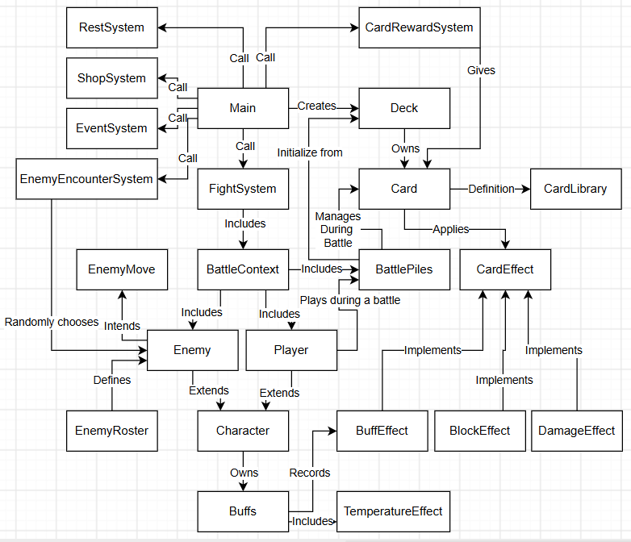

# SlayVT

SlayVT is a Java 8, text-based deck-building game created for CS 2114 Project 1 at Virginia Tech. Play through a 15-floor run, choose rooms, build and upgrade a deck, and fight enemies using Heat and Cold. Reversing a target's temperature deals temperature-difference damage.

Public repository: [ultra-dog/SlayVT](https://github.com/ultra-dog/SlayVT).

## Requirements

- Java Development Kit (JDK) 8 or newer. A JRE alone cannot compile the source.
- A terminal, or Eclipse with Java support. No external libraries are required to run the game.

## Compile and run

From the repository root, create a `build` directory (`mkdir build` on macOS/Linux, or `New-Item -ItemType Directory -Force build` in PowerShell). Then run:

```sh
javac -d build SlayVT/src/SlayVTGame/*.java
java -cp build SlayVTGame.Main
```

The first command compiles all source and test classes into `build`; the second starts the game. If `javac` is not recognized, install a JDK and add its `bin` directory to your PATH.

### Eclipse

Import the `SlayVT` folder inside this repository as an **Existing Project into Workspace**. The project is configured for Java 8 and uses `src` and `test` as source folders. Run `SlayVTGame.Main` as a Java application.

## How to play

Choose **Normal Game** to start on floor 1, or **Test Mode** to choose a starting floor for a shorter demonstration. Enter your name and choose the Meteorologist. Use the numbered menu options to choose rooms and play cards. During battle, choose a card, then an enemy when the card needs a target; enter `0` to end your turn. Cards consume Energy, and your hand is replenished each turn.

Heat deals damage at the end of your turn. Cold and Heat use signed temperature stacks; switching a target from one to the other deals damage based on the temperature difference. Winning battles can award cards. The shop sells cards and removes one card per visit; the Rest Site can heal you or upgrade a card. Virginia Tech-themed Event rooms offer one-time choices involving cards, Gold, or HP. The final floor contains the boss.

## Tests

The repository currently contains self-contained Java test classes with `main` methods. After compiling, run a test by name, for example:

```sh
java -cp build SlayVTGame.CardMechanicsTest
java -cp build SlayVTGame.TemperatureTest
```

Other standalone test classes are in `SlayVT/src/SlayVTGame/` and end in `Test.java`. `SourceLayoutTest` additionally needs the absolute path to `SlayVT/src` as its argument.

JUnit 4 tests are in `SlayVT/test/SlayVTGame/`. In Eclipse, right-click `CoreGameplayJUnitTest.java` and choose **Run As > JUnit Test**. The project's `lib` folder includes the JUnit and Hamcrest jars used by these tests, so no Eclipse JUnit container setup is needed. The test suite covers normal and invalid input for damage, shop purchases, shop card removal, and deck card removal.

## System diagram



## Presentation

The [Deliverable 3 presentation](docs/SlayVT_Deliverable3.pptx) is an editable, white-background slide deck for the group's final talk and live demonstration. The team can add its own visual styling before submitting the slides to Canvas.

## Project layout

- `SlayVT/src/SlayVTGame/Main.java` — game entry point and floor progression.
- `SlayVT/src/SlayVTGame/CardLibrary.java` — card definitions and upgrades.
- `SlayVT/src/SlayVTGame/BattleSystem.java` — turn-based battles.
- `SlayVT/src/SlayVTGame/TemperatureEffect.java` — Heat/Cold reversal damage.
- `SlayVT/src/SlayVTGame/*Test.java` — current executable tests.
- `SlayVT/test/SlayVTGame/CoreGameplayJUnitTest.java` — JUnit 4 gameplay tests.
